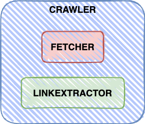

# website-crawler

## Architecture overview


The implementation of this crawler consists of three main pieces.

#### [Fetcher](pkg/fetcher)
The fetcher component is in charge of retrieving the contents of a specific webpage. And just that.
You can see two different fetcher implementations: HTTPFetcher and ExpBackoffRetryFetcher.

#### [Link Extractor](pkg/linkextractor)
This component deals with the extraction of the links from the retrieved webpage. 
In this case we implemented an HTML extractor that traverses all the webpage contents and gets all the links from a specific domain.

#### [Crawler](pkg/crawler)
The crawler itself is the one in charge of crawling a specific page using both the Fetcher and LinkExtractor.
The implemented crawler does this in a concurrent fashion. When new links are found, the crawler creates a new crawler for each link that starts crawling concurrently.

## How to use

#### Crawl
```shell
make URL=https://parserdigital.com
```

#### Run tests
```shell
make tests
```

